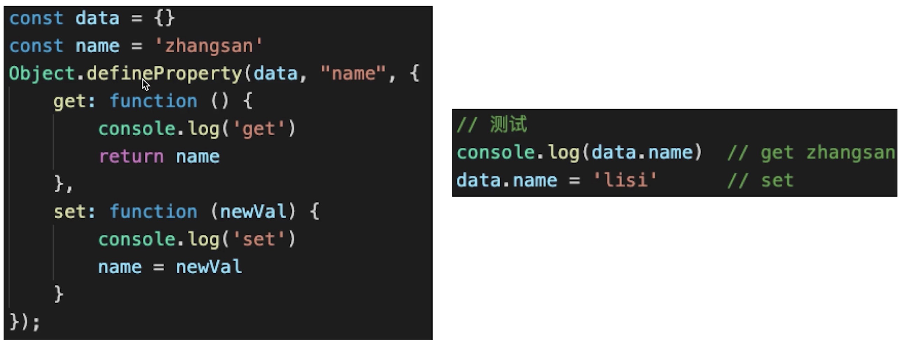
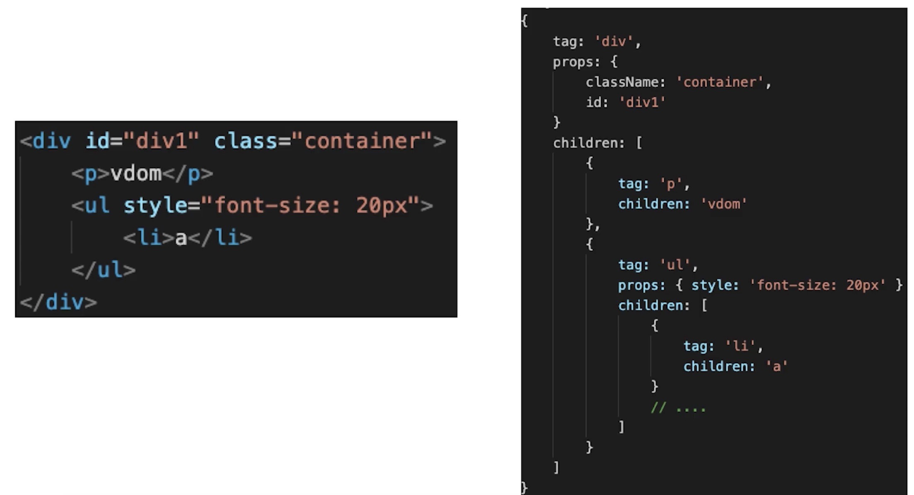
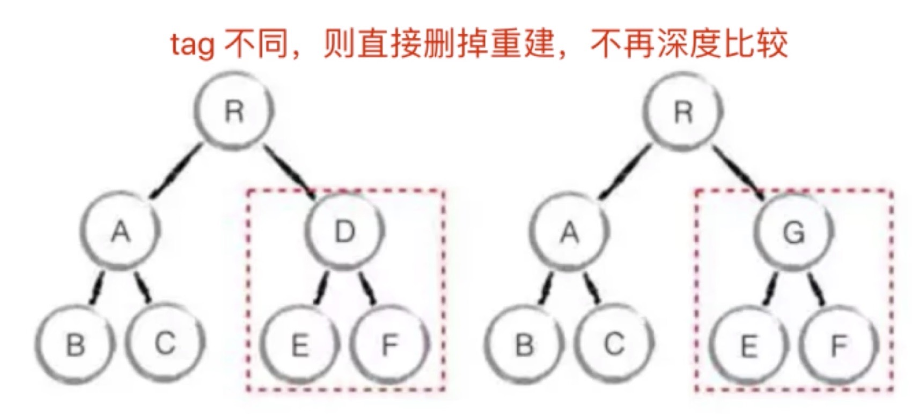
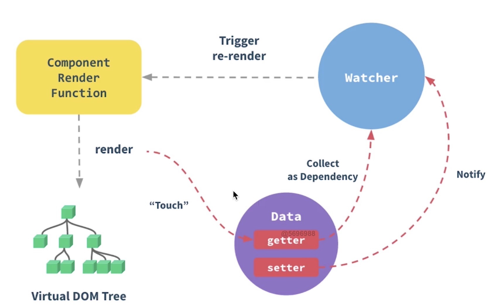
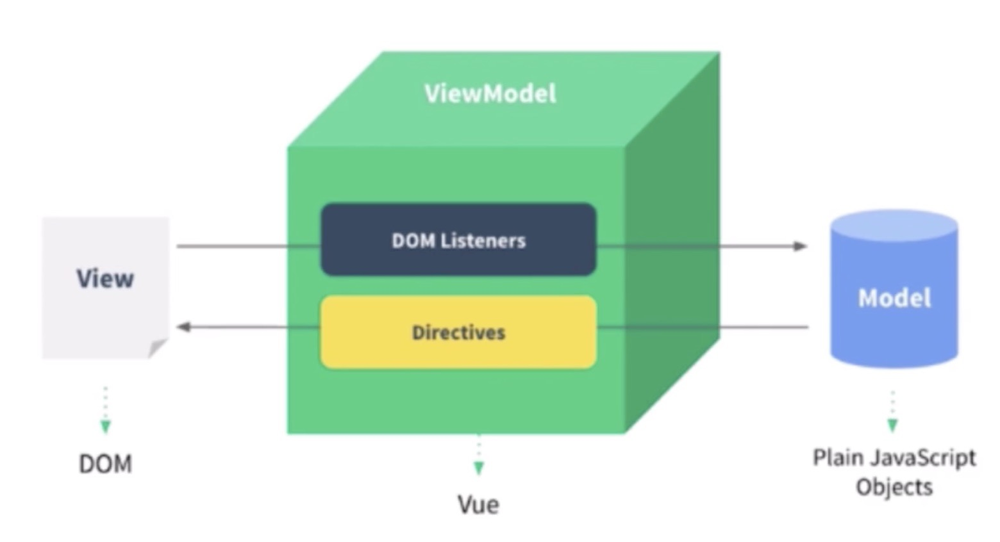
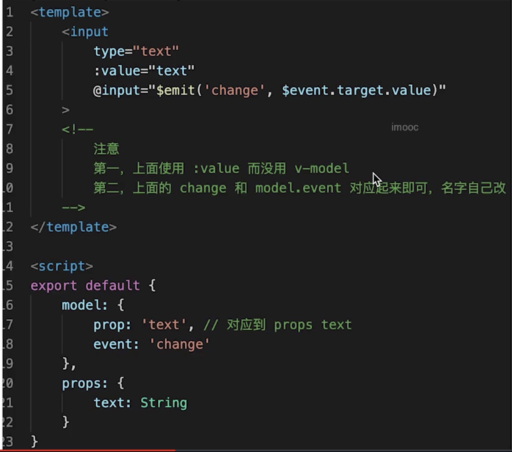

#### 原理
1. 范围
* 组件化
* 响应式
* vdom和diff
* 模板编译
* 渲染过程
* 前端路由

2. 组件化
* 很久以前就有组件化
* 做了一个创新:数据驱动视图: 传统组件,只是静态渲染,更新还要依赖于DOM;数据驱动视图-vue MVVM


3. vue响应式
* 组件data一旦变化，立刻触发视图更新
* 实现数据驱动视图的第一步
* 考察vue原理

----
* 核心api-Object.defineProperty
* 如何实现响应式,代码演示

1) 监听对象，监听数组
2）复杂对象，深度监听
3）几个缺点

```
function defineReactive(target, key, value){
    // 深度监听
    Observer(value)
    // 核心API
    Object.defineProperty(target, key, {
        get() {
            return value
        },
        set(newVal) {
            if (newVal != value) {
                // 深度监听
                Observer(value)
                value = newVal;
                // 触发更新视图
                updateView()
            }
        }
    })
}
function observer(target){
    if (typeof target !== 'object' && target == null) {
        // 不是对象或数组
        return target
    }
    // 重新定义各个属性
    for(let key in target) {
        defineReactive(target, key, target[key])
    }
}
observer(data)
```
* Object.defineProperty的一些缺点(proxy有兼容性问题,且无法polyfill)
1) 深度监听，需要递归到底，一次性计算量大
2） 无法监听新增属性/删除属性(Vue.set Vue.delete)
3) 无法监听数组,需要特殊处理

4. vue如何监听数组变化
```
// 重新定义数组原型
const oldArrayProperty = Array.prototype
// 创建新对象，对象原型指向oldArrayProperty,再扩展新的方法不会影响原型
const arrProto = Object.create(oldArrayProperty)
['push','shift'].forEach(methodName => {
    arrProto[methodName] = function(){
        updateView()
        oldArrayProperty[methodName].call(this, ...arguments)
    }
})
function observer(target){
    if (typeof target !== 'object' && target == null) {
        // 不是对象或数组
        return target
    }
    if (Array.isArray(target)) {
        target.__proto__ = arrProto
    }
    // 重新定义各个属性
    for(let key in target) {
        defineReactive(target, key, target[key])
    }
}
```

5. 虚拟DOM和diff
* vdom是实现vue和react的重要基石
* diff算法是vdom中最核心最关键的部分
* vdom是热门话题
1). DOM操作非常耗费性能
2). 以前用jquery,可以自行控制DOM操作的时机,手动调整
3）.vue和react是数据驱动视图,如何有效控制DOM操作？
---
解决方案-vdom
* 有了一定复杂度，想减少计算次数比较难
* 能不能把计算, 更多的转移为js计算?因为js执行速度更快
* vdom-用js模拟DOM结构，计算出最小的变更，操作DOM(包含标签tag、props、子元素children)


6. vdom总结
* 用js模拟DOM结构
* 新旧vnode对比，得出最小的更新范围,最后更新DOM
* 数据驱动视图的模式下，有效控制DOM操作

7. vdom-diff算法
* 概述： diff即对比,是一个广泛的概念
* 两个对象也可做diff
* 两棵树也可做diff
* 树diff的时间复杂度（o(n^3)）
1) 第一：遍历树1，第二：遍历树2
2）第三：排序
* 优化时间复杂度到O(n)
1) 只比较同一层级,不跨级比较
2）tag不相同,则删掉重建,不再深度比较
3）tag和key,两者都相同,则认为是相同节点，不再比较


8. diff算法总结
* patchVnode
* addVnodes removeVnodes
* updateChildren(key的重要性):

9. vdom和diff-总结
* 细节不重要,updateChildred的过程也不重要,不要深究
* vdom核心概念很重要： h(生成vnode)、vnode、patch(对比vnode)、diff(patchvnode、updateChildren)、key(提高diff优化)等
* vdom存在的价值更加重要：数据驱动视图,控制dom操作等

10. 模板编译
---
* 模板是vue开发中最常用的部分
* 他不是html,有指令、插值、js表达式,到底是什么？
* 会通过"组件渲染和更新过程"考察
---
* 前置知识： js的with语法
* vue template compiler将模板编译为render函数
* 执行render函数生成vnode
---
* 改变{}内自由变量的查找规则,当做obj属性来查找
* 如果找不到匹配的obj属性,就会报错
* with要慎用,打破了作用域规则，易读性变差

11. vue模板被编译成什么
* 模板不是html,有指令、插值、js表达式,能实现判断、循环
* html是标签语言,只有js才能实现判断，循环
* 因此,模板一定是转换为某种js代码,即编译模板
```
var template = `<p>{{message}}</p>`
//render函数，返回vnode with(this){return createElement('p', [createTextVnode(toString(message))])}
// createElement -> vnode
```
总结
---
* 模板编译为render函数,执行render函数返回vnode
* 基于vnode再执行patch和diff
* webpack vue-loader，会在开发环境下进行编译模板（重要）

12. vue组件中使用render代替template
```
render: function(createElement){
    return createElement(
        'h' + this.level,
        [
            createElement('a', {
                attrs: {
                    name: 'headerId',
                    hreft: '#' + 'headerId'
                }
            }, 'this is a tag')   
        ]
    )
}
```
模板编译知识点
---
* with语法
* 模板到render函数,再到vnode,再到渲染和更新
* vue组件可以用render代替template

13. 总结
* 一个组件渲染到页面，修改data触发更新(数据驱动视图)
* 其背后原理是什么,要掌握哪些要点
* 考察对流程了解的全面程度
---
* 响应式： getted，setter,对象监听(深度监听)，数组监听（修改原型方法）
* 模板编译: 模板编译成render函数,再到vnode
* vdom：patch(vnode, container)和patch(newvnode, oldVnode)

14. 组件更新、渲染过程
* 要点：初次渲染、更新、异步渲染
* 初次渲染
1) 解析模板为render函数
2) 触发响应式,监听data属性getter、setter
3） 执行render函数(会触发getter)，生成vnode,patch(elem, vnode)
* 更新过程
1) 修改data,触发setter
2) 重新执行render函数,生成newvnode
3) patch(vnode, newvnode)


* 异步渲染
1) 回顾$nextTick
2) 汇总data修改,一次渲染视图
3) 减少Dom操作,提高性能

15. 前端路由原理
* hash
    1) hash会触发网页跳转,即浏览器的前进后退
    2）hash变化不会刷新页面
    3）hash不会提交到server端
    ```
    window.hashChange = function(event){
        console.log('old url', event.oldURL)
        console.log('new url', event.newURL)
        console.log(location.hash)
    }
    ```
* h5 history
    1) 用url规范的路由，但跳转时不刷新页面
    2） history.pushState
    3) window.onPopstate
    ```
    history.pushState({name: 'page1'}, '', 'page1')
    window.onpopstate = event => {
        console.log('popstate', event.state,location.pathname)
    }
    ```

    #### 面试真题
    1. v-show和v-if区别？ 
    ```
    v-show通过display控制显示和隐藏
    v-if是组件的真正渲染和销毁,而不是显示和隐藏
    频繁切换用v-show
    ```
    2. 为何在v-for中使用key
    ```
    必须用key,切不能是index和random
    diff算法中通过key和tag来判断,是否是sameNode
    减少渲染次数，提升渲染性能
    ```
    3. 描述vue组件生命周期（父子组件）
    * 单组件生命周期
    * 父子组件生命周期

    4. 组件生活通讯
    * 父子组件
    * 自定义事件-event.$emit
    * vuex

    5. 组件渲染和更新过程
    

    6. 双向数据绑定v-model的实现原理
    * input元素的value=this.name
    * 绑定input 时间的this.name=$event.target.value
    * data更新触发re-render

    7. 对mvvm的理解
    

    8. computed有何特点
    * 有缓存，data不变，不会重新计算
    * 提高性能

    9. 为何data必须是函数
    * .vue文件是一个class,在使用的时候就是实例化,如果不是函数这样的写法,2个实例的数据就会相互影响

    10. ajax请求应该放在哪个生命周期
    * monted(渲染完成，dom加载完成)
    * js是单线程的，ajax是异步获取数据
    * 放在monted之前没有用，只会让逻辑更混乱

    11. 如何将所有props传递给子组件
    * $props
    * <User v-bind="$props"> 

    12. 自定义model?
    
    13. 组件逻辑抽离

    14. 何时要使用异步组件
    * 加载大组件
    * 路由异步加载

    15. 何时使用keep-alive
    * 缓存组件，不需要重复渲染
    * 多个静态tab页切换

    16. 何时需要使用beforeDestroy
    * 接触自定义事件event.$off
    * 定时器
    * 接触绑定自定义DOM事件, 如window.onscroll

    17. 作用域插槽


    18. vuex中action和mutation区别
    * action处理异步，mutation不可以
    * mutation做院子操作
    * action可以整合多个mutation

    19. vue-router常用模式
    * hash
    * h5 history
    * 两者选择

    20. 如何配置vue-router异步加载
    ```
    new VueRouter({
        routes: [
            {
                path: '',
                component: ()=>import('../base')
            }
        ]
    })
    ```

    21. 请用vnode描述一个DOM结构
    tag，props,children

    22. 监听data变化的核心api是什么
    * Object.defineProperty
    * 以及深度监听， 监听数组
    * 有何缺点

    23. vuer如何监听数组变化
    * Object.defineProperty不能监听数组变化
    * 重新定义原型,重写pushpop方法

    24. 请描述响应式原理
    * 监听data变化
    * 组件渲染和更新的流程

    25. diff算法时间复杂度
    O(n)
    O(n^3) 只比较同一层级,不跨级比较

    26. diff算法过程
    * patch(elem, vnode)和patch(newvnode, oldvnode)
    * patchVnode和addvnode和removevnode
    * updateChildren(key的重要性)

    27. vue为何是异步渲染,$nextTice何用
    * 异步渲染，提高渲染性能
    * $nextTick再dom更新完成后，触发回调

    28. vue性能优化
    * 合理使用v-show、v-if
    * 合理使用computed
    * v-for时加key
    * 自定义事件，dom事件销毁
    * 合理使用异步组件
    * 合理使用keep-alive
    * data层级不要太深（递归太多）
    * 使用vue-loader在开发环境做模板编译
    * webpack层面的优化
    * 通用性能优化,图片懒加载
    * 使用ssr


#### Vue3升级内容

* 全部用ts重写(响应式、vdom、模板编译)
* 性能提升 代码减少
```
const data = {
    name: 'zhangsan',
    age: 20
}
const proxyData = new Proxy(data, {
    get(target, key, receiver) {
        const ownKeys = Reflect.ownKeys(target)
        if (ownKeys.includes(key)) {
            console.log('get', key)
        }
        const result = Reflect.get(target, key, receiver)
        return result;
    },
    set(target, key, val, receiver) {
        const oldVal = target[key]
        if (oldVal == val) return true;
        const result = Reflect.set(target, key, val, receiver)
        return result;
    },
    deleteProperty(target, key){
        const result = Reflect.deleteProperty(target, key)
        return result;
    }
})
``` 
Reflect和proxy能力一一对应
```
const data = {
    name: 'zhangsan',
    age: 20
}
function reactive(target){
    if (typeof target !== 'object' || target == null) {
        return target
    }
    const proxyConf = {
        get(target, key, receiver) {
            const ownKeys = Reflect.ownKeys(target)
            if (ownKeys.includes(key)) {
                console.log('get', key)
            }
            const result = Reflect.get(target, key, receiver)
            // 深度监听
            // 性能提升： 获取的时候才进行递归
            return reactive(target[key]);
        },
        set(target, key, val, receiver) {
            const oldVal = target[key]
            if (oldVal == val) return true;
            const result = Reflect.set(target, key, val, receiver)
            return result;
        },
        deleteProperty(target, key){
            const result = Reflect.deleteProperty(target, key)
            return result;
        }
    }
    // 生成代理对象
    return new Proxy(target, proxyConf)
}
const proxyData = reactive(data)
```

缺点
---
* Proxy能规避Object.defineProperty
* 无法兼容所有浏览器

